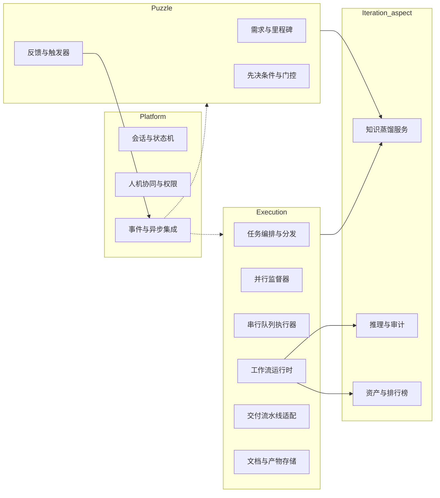

# 后端模块划分（可独立抽象的能力）

以下模块均可抽象为**独立后端**能力（单体内的模块化包或多服务均可），以便拼图、执行、迭代切面**分别演进**。**开发过程中须预留扩展性**：稳定 API/事件契约、适配器层、可替换的存储与模型实现。

> 待完善：为每个模块补充 REST/GraphQL/事件名、版本策略与仓库内包路径（如 `server/`、`packages/api/`）。

## 扩展性原则

- **领域层**不依赖具体 LLM/SDK；**集成层 Adapter** 注入。  
- 拼图与执行、迭代切面之间以**领域事件 + 异步消息**解耦；拼图**触发器**不得阻塞执行队列。  
- **并行/串行策略、监督参数、队列配置** 等须**可持久化、可审计**，与「强制选择并行或串行」的产品规则一致。  
- 前端与脚本仅通过**契约**（OpenAPI、事件 Schema、文档路径约定）访问这些能力，避免隐式耦合。

## 模块列表（按职责）

| # | 模块 | 职责摘要 | 主要关联环节 |
| --- | --- | --- | --- |
| 1 | 需求与里程碑 | 需求版本、拆解、里程碑 CRUD、与 `docs/requirements` 同步 | 拼图 |
| 2 | 先决条件与门控 | Prerequisite 模型、Satisfied/Unsatisfied 评估、门控状态机 | 拼图 → 执行 |
| 3 | 反馈与触发器 | 有效反馈判定、**异步唤醒拼图**、与用户对话/会话绑定 | 拼图、迭代 |
| 4 | 会话与状态机 | **`session_id`** 贯通执行轮次与状态变迁（定义见 [sessions.md](../sessions/sessions.md)）；跨环快照；与 `docs/sessions` 等载体对齐 | 全科 |
| 5 | 知识蒸馏服务 | Session 结束或阶段结束蒸馏产物持久化、检索与版本 | 迭代切面 |
| 6 | 任务编排与分发 | **混合智能体**决策、**强制**并行或串行策略、DAG/队列持久化 | 执行 |
| 7 | 并行监督器 | 依赖与冲突检测、租约/锁、冲突升级至**智能体建议 + 人工决断** | 执行 |
| 8 | 串行队列执行器 | 单通道调度、资源限额、暂停/恢复、降低资源损耗 | 执行 |
| 9 | 工作流运行时 | **1 : 1 Task–Workflow**、步骤状态机、与 `docs/tasks/workflows` 同步 | 执行 |
| 10 | 交付流水线适配 | Check / Merge / Build / Clean；Git、构建、Linter 等集成 | 执行 |
| 11 | 推理与审计 | 失败根因、推理轨迹、生成**可消费反馈** | 迭代切面 |
| 12 | 资产与排行榜 | 工作流正式化、检索、**使用频次排行**、复用推荐 | 迭代切面 |
| 13 | 人机协同与权限 | 审批、委派、证据留存、决断记录 | 全科 |
| 14 | 文档与产物存储 | `docs/output`、对象/文件抽象、产物与用户确认关联 | 执行、拼图 |
| 15 | 事件与异步集成 | 领域事件、Outbox/可靠投递、拼图与执行环**解耦** | 平台 |

## 模块边界示意

详见 [core-logic.md](../core-logic.md) 与 [step1-implementation-plan.md](./step1-implementation-plan.md) 中的产品架构与仓库路径约定。
