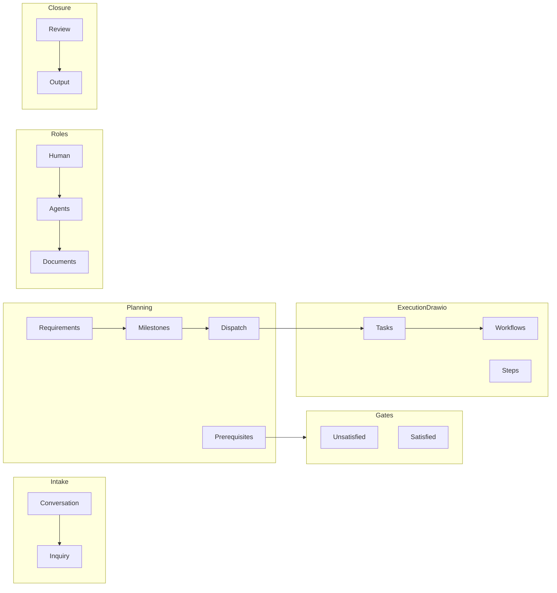

# Step 1 实施计划：基础目录、文档骨架与工程基线

> Archived: 本文档记录旧原型期 Step 1 落地计划，只用于理解历史脚手架是如何搭出来的；它不是当前 `dp-ring v2` 的实施计划。

> 本文档汇总仓库脚手架与文档树的执行约定，与 [prototype/Adaptive-Flywheel.md](../../prototype/Adaptive-Flywheel.md)、[prototype/Adaptive-Flywheel.drawio](../../prototype/Adaptive-Flywheel.drawio) 对齐。  
> 技术栈：**TypeScript + React（Vite）**；容器：**多阶段 Dockerfile（Node 构建 + nginx 静态服务）**。

---

## 执行清单（Todos）

- [x] **vite-react-ts**：Vite + React + TS 配置、`src` 入口、`.gitignore`、`package.json` 按下文「依赖版本锁定」精确版本 + 提交 `package-lock.json`
- [x] **root-docs**：`README.md`、`INDEX.md`、`VALUE.md`（链接与最小占位）
- [x] **docs-tree**：按 Adaptive-Flywheel.md 展开完整 `docs/**`；`docs/product/` 下 `adaptive-flywheel.md`、`backend-modules.md`；两循环一切面正文在 `docs/core-logic.md`
- [x] **tests-placeholder**：`tests/` 下按模板占位（如 `tests/example/.gitkeep`）
- [x] **docker-baseline**：`Dockerfile`、`nginx.conf`、`.dockerignore`，README / `docs/repository-layout.md` 中简述用法
- [x] **verify-build**：`npm ci` / `npm install`、`npm run build`、`npm run typecheck`、`npm run lint`；可选 `docker build` 冒烟

---

## 产品架构：两个循环 + 一个切面

在旧体系中，**拼图循环、执行循环与迭代切面**的**定义、步骤顺序、并行/串行约束、文字箭头及与 `session_id` 的边界**以 [core-logic.md](../core-logic.md) 为主要正文说明。与 [Adaptive-Flywheel.drawio](../../prototype/Adaptive-Flywheel.drawio) 节点名的对照见下文「设计对齐」草图。

### 与仓库实现的对应（Step 1）

- **前端**：`src/` 可先保持极简；若需目录即体现架构，可预留 `src/puzzle/`、`src/execution/`、`src/iteration/`（或统一 `src/features/`，在 `docs/repository-layout.md` 中说明）。
- **后端**：本步可不写服务端代码；在 `docs/repository-layout.md` 与 [backend-modules.md](./backend-modules.md) 中约定未来路径（如 `server/` 或 `packages/api/`）。

### 扩展性约束（写入 specs 时沿用）

领域层不直接依赖具体 LLM SDK；集成层 Adapter；关键状态变更发布**领域事件**；拼图与执行之间优先 **async 消息** 解耦。

---

## 设计对齐（drawio 概念草图）

细粒度流程与顺序依赖以 [core-logic.md](../core-logic.md) 为准；下图便于与 [Adaptive-Flywheel.drawio](../../prototype/Adaptive-Flywheel.drawio) 对照。

---

## 仓库根目录规划

| 区域 | 用途 |
| --- | --- |
| 根目录 `package.json`、`vite.config.ts`、`tsconfig*`、`index.html` | Vite + React + TS |
| `src/` | `main.tsx`、`App.tsx`、`vite-env.d.ts`；可选预留 `components/`、`features/`、`lib/` |
| `public/` | 静态资源 |
| `tests/` | 按模板 `tests/module-name/` 占位 |
| `docs/` | Adaptive-Flywheel 文档树 + `docs/product/` |
| `prototype/` | 保持设计稿；不在 Step 1 改 drawio |
| `Dockerfile`、`nginx.conf`、`.dockerignore` | 构建与静态部署基线 |

根文档：**`README.md`**（介绍、安装、启动、链到 INDEX / VALUE）、**`INDEX.md`**（文档总索引）、**`VALUE.md`**（核心价值占位）。

---

## `docs/` 树（落地 Adaptive-Flywheel.md）

按模板创建**文件 + 子目录**；空目录用 `.gitkeep`。

### 一级 `docs/`

- `repository-layout.md` — 根目录、`src/`、`docs/`、`tests/`、`prototype/`；**未来后端路径约定**
- `technology-stack.md` — 与下文「依赖版本锁定」一致，可引用 `package.json` / lockfile
- `documentation-standards.md` — 文档与注释规范占位
- `redline.md` — 红线占位

### `docs/specs/`

- `specs/coding/coding-standards.md`
- `specs/testing/testing-standards.md`
- `specs/review/review-standards.md`
- `specs/tasks/task-standards.md`
- `specs/workflow/workflow-standards.md`

### `docs/requirements/`

- `checklist.md`
- `archive/.gitkeep`
- 示例包：`requirements/r1-requirement-name/r1-requirement-name.md`、`references/.gitkeep`、`milestones/prerequisites.md`、`milestones/r1m1-milestone-name.md`

### `docs/tasks/`

- `t1-task-name/t1-task-name.md`
- `workflows/t1w1-workflow-name/t1w1-workflow-name.md`、`t1w1s1-step-name.md`、`logs/.gitkeep`

### 其余

- `sessions/sessions.md`、`sessions/archive/.gitkeep`
- `assets/failure-reasoning/.gitkeep`、`assets/formalized_workflow/.gitkeep`
- `output/.gitkeep`
- `procedure/preparation/`、`reasoning/`、`formalization/`、`distillation/`、`evolution/`（各 `.gitkeep` 或占位说明）
- `feedbacks/Feedback.md`、`feedbacks/archive/.gitkeep`、`f1-feedback-name/feedback-name.md`

### `docs/product/`（Step 1 与架构说明）

| 文件 | 说明 |
| --- | --- |
| `step1-implementation-plan.md` | 本文件 |
| `adaptive-flywheel.md` | drawio 节点与前端能力映射（占位） |
| `../core-logic.md` | 两个循环一个切面：定义、顺序、文字箭头（正文口径） |
| `backend-modules.md` | 后端模块表与 API/事件契约留白 |

每份 Markdown 建议最小结构：`# 标题`、一句说明、`> 待完善：` 引导后续补写。

---

## 前端工程（Step 1 范围）

- Vite 官方 React + TS 思路：`index.html`、`src/main.tsx`、`src/App.tsx` 占位 UI；**本步不引入路由 / 全局状态库**。
- `tsconfig`：`strict: true`。
- `package.json` scripts：`dev`、`build`、`preview`；可选 `typecheck`：`tsc --noEmit`。
- `.gitignore`：`node_modules`、`dist`、编辑器噪音、`.env*`（密钥不进库）。

---

## 依赖与镜像版本锁定

> **基准**：下列版本供 Step 1 锁定；执行时 `package.json` 使用**精确版本**（无 `^` / `~`），并提交 `package-lock.json`。安全补丁可后续单包升级并更新本文档与 `technology-stack.md`。

### 生产依赖（dependencies）

| 包 | 版本 |
| --- | --- |
| `react` | `19.2.4` |
| `react-dom` | `19.2.4` |

### 开发依赖（devDependencies）

| 包 | 版本 |
| --- | --- |
| `typescript` | `5.8.3` |
| `vite` | `8.0.3` |
| `@vitejs/plugin-react` | `6.0.1` |
| `@types/react` | `19.2.14` |
| `@types/react-dom` | `19.2.3` |
| `@types/node` | `22.19.15` |
| `eslint` | `10.1.0` |
| `@eslint/js` | `10.0.1` |
| `typescript-eslint` | `8.58.0` |
| `eslint-plugin-react-hooks` | `7.0.1` |
| `eslint-plugin-react-refresh` | `0.5.2` |
| `globals` | `17.4.0` |

**TypeScript**：优先 5.8.3 以降低与 Vite 8 插件链的兼容风险；若升级到 6.0.x，须单独跑通 `build` 与 ESLint。

### Docker 基础镜像

| 用途 | 镜像 |
| --- | --- |
| 构建 | `node:22.22.2-alpine` |
| 运行 | `nginx:1.28.2-alpine` |

构建阶段 Node 主版本与 `@types/node` 22.x 对齐；若改用 Node 24，需同步替换镜像与类型包并复验构建。

### 其他

- 包管理器：**npm**；锁文件：`package-lock.json`。
- 可选 `package.json`：`"engines": { "node": ">=22.19.0" }`。

---

## 容器化（Docker）

- **`.dockerignore`**：排除 `node_modules`、`dist`、`.git`、`coverage`、编辑器等。
- **`Dockerfile`（多阶段）**：
  1. **build**：`node:22.22.2-alpine`，`WORKDIR /app`，复制 `package.json` 与 `package-lock.json`，`npm ci`，复制源码，`npm run build`。
  2. **runtime**：`nginx:1.28.2-alpine`，复制 `dist/`；**`nginx.conf`** 对 SPA 使用 `try_files $uri $uri/ /index.html;`。
  3. `EXPOSE 80`（或与 nginx `listen` 一致）；`CMD` 启动 nginx。

**README**：增加 `docker build -t dp-ring .` 与 `docker run -p 8080:80 ...` 示例。

Step 1 **不引入** docker compose、数据库或后端服务；开发期以本机 `npm run dev` 为主。

---

## 可抽象为独立后端的功能模块（预留）

详见 [backend-modules.md](./backend-modules.md)。摘要编号：

1. 需求与里程碑  
2. 先决条件与门控  
3. 反馈与触发器  
4. 会话与状态机  
5. 知识蒸馏服务  
6. 任务编排与分发  
7. 并行监督器  
8. 串行队列执行器  
9. 工作流运行时  
10. 交付流水线适配（Check / Merge / Build / Clean）  
11. 推理与审计  
12. 资产与排行榜  
13. 人机协同与权限  
14. 文档与产物存储  

---

## 执行顺序建议

1. `.gitignore`、Vite/React/TS、最小 `src/`。  
2. 批量创建 `docs/**`、根 `INDEX.md` / `VALUE.md`、更新 `README.md`。  
3. `docs/product` 下 `adaptive-flywheel.md`、`backend-modules.md`，以及 `docs/core-logic.md`（可与本文件交叉链接）。  
4. `Dockerfile`、`nginx.conf`、`.dockerignore`。  
5. `npm install`、`npm run build`；（可选）`docker build` 冒烟。

---

## 风险与约定

- **文档量大**：占位宜短；以 `INDEX.md` 为总入口。  
- **drawio 笔误**：如 `R!M2`、`R3M3` 以需求文档为准。  
- **prototype**：Step 1 不修改 `prototype/*.drawio`，除非另开任务。

---

## 相关路径

- 原型文档索引：[prototype/Adaptive-Flywheel.md](../../prototype/Adaptive-Flywheel.md)  
- 图表：[prototype/Adaptive-Flywheel.drawio](../../prototype/Adaptive-Flywheel.drawio)
